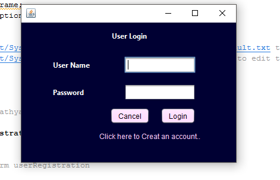
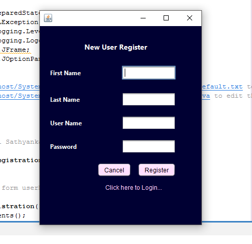

# User-Registration-And-Login-Form-Java-MySQL
A Java MySQL project which pops up of a small login and registration window. This window connects to a local mysql database to see if the login can be concluded or not.
 

## About this project
The goal of this project is to create a simple login app on which the user can enter the username and password and click login buttom. If username and password are in the database, then a message dialog will pop up and yell the success; else, another message dialog will pop yelling the failure. New users can register to the system by providing requierd details.user can cancel the process using 'cancel' button. 

## Built With
<ul>
<li>NetBeans: Fits the pieces together.

<li>MySQL: The world's most popular open source database.

<li>XAMPP: Installers and Downloaders for Apache Friends.
  
